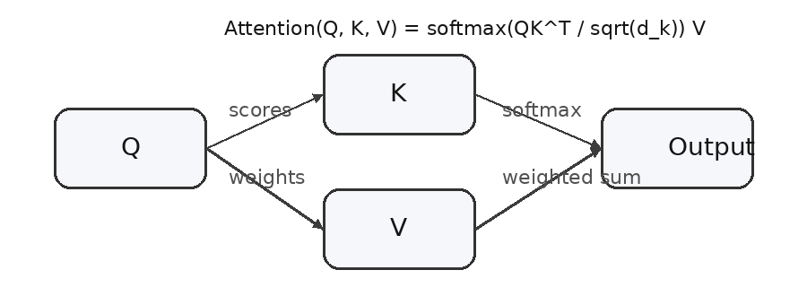

# 带公式和图片的 Markdown 测试

这是一个用于测试 Markdown 转 Word 的示例文件。

## 行内公式

爱因斯坦质能方程是 $E = mc^2$。Transformer 里的注意力权重可以写成 $\alpha_i = \operatorname{softmax}(q_i k_i^T)$。

## 独立公式

$$
\operatorname{Attention}(Q,K,V)=\operatorname{softmax}\left(\frac{QK^T}{\sqrt{d_k}}\right)V
$$

$$
L_{CE}=-\sum_{i=1}^{C} y_i \log p_i
$$

## 表格里的公式

| 名称 | 公式 | 说明 |
|---|---|---|
| Softmax | $p_i=\frac{e^{z_i}}{\sum_j e^{z_j}}$ | 把 logits 转换成概率 |
| Bayes | $P(A\mid B)=\frac{P(B\mid A)P(A)}{P(B)}$ | 条件概率公式 |

## 图片

下面是一张本地图片。测试时请选择整个 `sample-assets` 文件夹，或者单独上传 `attention.png`。



## 代码块

代码块里的公式不应该被渲染：

```text
$E = mc^2$
$$
L=-\sum_i y_i\log p_i
$$
```
